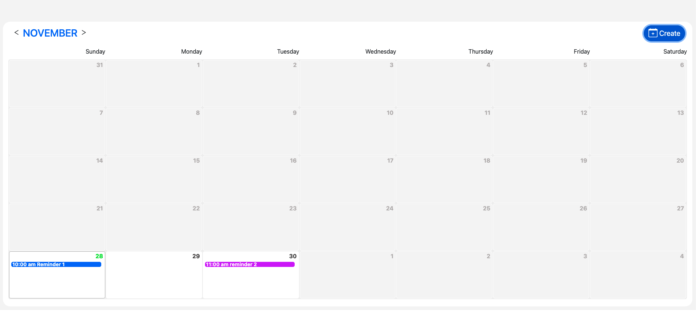

# vue-calendar



This project is designed to test your knowledge of front-end web technologies and assess your ability to create front-end UI products with attention to details, cross-browser compatibility, standards, and reusability.

The goal was to create a calendar application where it is possible to add a reminder by adding title, date, time, color and city. adding a weather service to present the weather forecast for the current day of your reminder depending on the city

## Project setup
```
npm install
```

### Compiles and hot-reloads for development
```
npm run serve
```

### Compiles and minifies for production
```
npm run build
```
